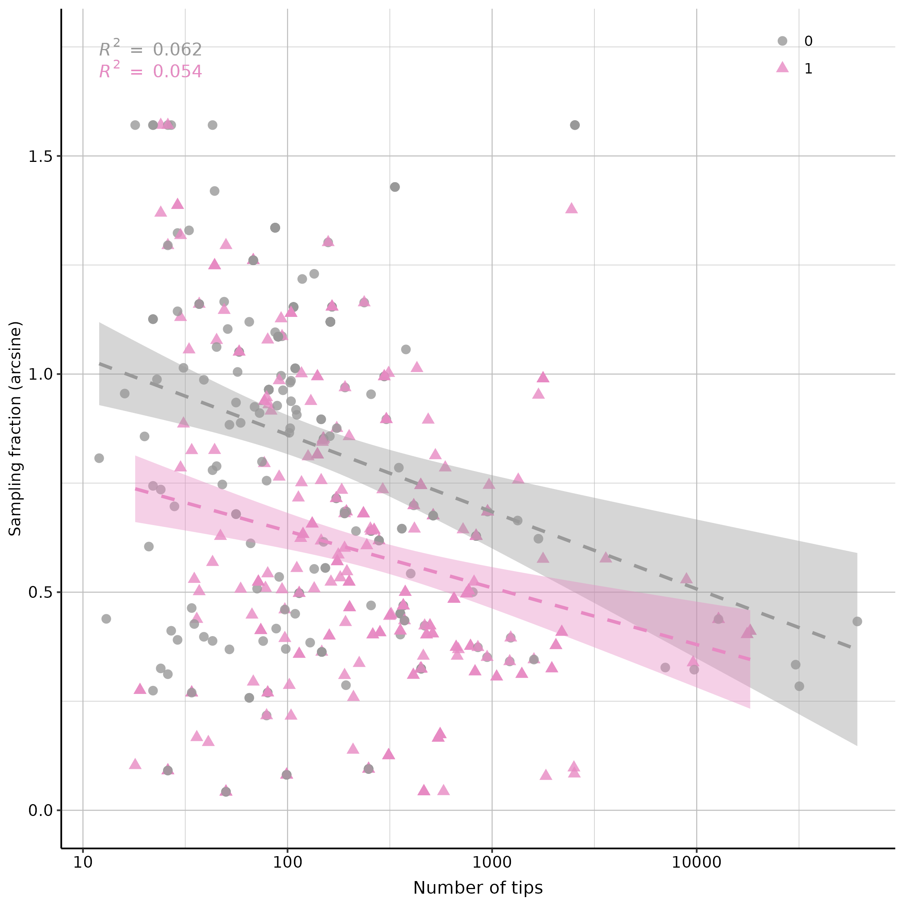

<!-- README.md is generated from README.Rmd. Please edit that file -->


```{r, include = FALSE}
knitr::opts_chunk$set(
  collapse  = TRUE,
  comment   = "#>",
  fig.path  = "man/figures/",
  out.width = "100%"
)
```


# sseReview


<!-- badges: start -->
[](https://github.com/ajhelmstetter/sseReview/actions/workflows/R-CMD-check.yaml)
[](https://choosealicense.com/licenses/gpl-2.0/)
[](#)
<!-- badges: end -->


Research Compendium of the project **DiveRS -SSE review**


### How to cite

Please cite this compendium as: 

> **{{ PLEASE ADD A CITATION }}**


### Content

This repository is structured as follow:

- [`data/`](https://github.com/ajhelmstetter/sseReview/tree/master/data):
contains all raw data required to perform analyses

- [`rscripts/`](https://github.com/ajhelmstetter/sseReview/tree/master/rscripts/):
contains R scripts to run each step of the workflow

- [`outputs/`](https://github.com/ajhelmstetter/sseReview/tree/master/outputs):
contains all the results created during the workflow

- [`figures/`](https://github.com/ajhelmstetter/sseReview/tree/master/figures):
contains all the figures created during the workflow

- [`paper/`](https://github.com/ajhelmstetter/sseReview/tree/master/paper):
contains all the manuscript and related content (biblio, templates, etc.)

- [`R/`](https://github.com/ajhelmstetter/sseReview/tree/master/R):
contains R functions developed especially for this project

- [`man/`](https://github.com/ajhelmstetter/sseReview/tree/master/man):
contains help files of R functions

- [`DESCRIPTION`](https://github.com/ajhelmstetter/sseReview/tree/master/DESCRIPTION):
contains project metadata (author, date, dependencies, etc.)

- [`make.R`](https://github.com/ajhelmstetter/sseReview/tree/master/make.R):
master R script to run the entire project by calling each R script stored in the `rscripts/` folder


### Usage

Clone the repository, open the `.Rproj` file in RStudio and run:

```{r eval = FALSE}
source("make.R")
```

### Notes

- All required packages, listed in the `DESCRIPTION` file, will be installed (if necessary)
- All required packages and R functions will be loaded
- Some analyses listed in the `make.R` might take time


one liner to get years from text file of names of papers:

```{bash eval = FALSE}
grep -Eo '_[0-9]*_' years.txt | grep -Eo '[0-9]*' > years_only.txt
```

How many markers to put if study uses backbone with many markers, and adds taxa with few markers?

Base pairs vs numbers of markers 

cpDNA/mtDNA one marker or several?

how to categorise non binary results - root?

maximize reporting of sp and ext rate changes where missing

quasse causing trouble in models

waht is time supposed to capture? breadth of clade or methodological effect of age
-cannot compare rates when times are not in Ma

semi.auto.paired returning 'answ not found' when paired matches arent found

What if larger phylogeny is trimmed based on data? Size of phylogeny or tips used in -SSE model?

prevelence of outgroups biasing -SSE results?

how does number of different models in study affect outcome?

### Database issues :

* MuSSE results to be reclassifed to 1 to number of categories where 1 is highest rate
* GeoSSE results - how to deal with species in both areas?
* How to deal with RADseq - 1 marker (concatenated) or 42900 markers (or get rid?)
* what if analyses are on larger groups than angiosperms as all seed plants - currently included
* what about when papers use explicitly bisse and hisse without being nested? include both? check
* ask authors to cross-check results

### Paper issues :

* De Vos et al. 2014 - many versions of bisse on subsets, only one included
* Onstein_et_al_2018_To_adapt_or_go_extinct_The_fate_of_megafaunal_pal.txt did analyses on whole world and then new world and old world specifically, what do with this?

## To talk about SSE review meeting

root state :

* reported root state often estimated via another approach than -SSE
	* this may be different due to -SSE estimation taking into account div rates
* do methods like geosse also give root states? 

best predictors :

* all dataset variables, rather than trait variables

focus on diversification rate, but perhaps speciation and extinction results could be informative re: LP.

### Paper collection method

Find -SSE methods papers on google scholar (see map)
Search citing literature for 'plant'
Import PDF and metadata of papers from their website w/ Zotero
Rename PDF based on metadata
Rename PDF to remove unwanted characters

```{bash eval = FALSE}
#modifying filenames to be readable
#TO DO: REMOVE "()" as well
rename 's/[\.,-]/_/g' *
rename 's/[\"]//g' *
rename "s/\'//g" *
rename 's/ /_/g' *
rename 's/_+/_/g' *
rename 's/_pdf/\.pdf/g' *
rename 's/\(//g' *
rename 's/\)//g' *
```

Remove papers that contain non-angiosperms
Run pdftotext on all PDFs to create text file for papieRmache

### -SSE-athon

Five groups : 

Alcantara - Castillo
Chauveau - Hipp
Horn - Matuszak
Mayrose - Serrano
Silvestro - Zenil-Ferguson

### Meeting early May

To do :
* Number of studies vs size of order (done)
* sampling fraction vs number of species of clade of interest (done)
* how do hidden states affect proportion significant (done)
  * what happens when we throw out bad studies?
* studies on same clades but different trees
* traits in figures are per study/per model? e.g. square plots
* use bigger categories for xgboost / paired barplots (done)

Discussion points :
* error in trait vs real association (or lack of)
* quality of data across different trait types
* if you dont think this is true about your trait of interest then here's how you should improve/choose your studies
* difficulty of getting trait data, how does this affect patterns?

### Meeting 25/05/21

To do :
* description of columns of spreadsheet written down
* stacked barplot (done)
* correlation between age and tips (done)
* sampling fraction over time
* colour xgboost based on whether they are model vs plant trait - data quality, tree, model, characters
* age reclassification?
* reclassify as multi-category rather than binary?
* machine learning explains interactions? (check)
* recode multistate models
* recode div/spe/ext to one column 

Discussion points :
* random spot checks of data rather than everything
* importance of time calibration accuracy
* skeletal fractions vs global sampling fraction

### Plots

 

Figure 1. Stacked barplot of -SSE model use over time in angiosperms. Bars represent total number of times different models are used. Multiple different models can be taken from a single study, but if the same model is used multiple times it is only counted once. Black line indicates the number of studies published per year.

 

Figure 2. Ridgeplot of number of tips (log) in phylogenetic trees used in -SSE model publications on angiosperm taxa. Density plots are shown for each year separately showing a gradual increase in the number of tips in the tree over time.  

 

Figure 3. Ridgeplot of number of tips (log) in publications using -SSE models in angiosperm taxa. Density plots are shown for each -SSE model type separately, showing those model types that tend to be used with higher numbers of tips.  


Figure 4. Treemap of the orders considered in angiosperm-based studies using -SSE methods.


Figure 5. Treemap of the trait types considered in angiosperm-based studies using -SSE methods.


Figure 6. Raincloud plots of distributions of the number of tips in the phylogenetic trees in studies that infer the an effect of the investigated trait (pink) or infer no effect (green). On average more tips are found in studies that find an association.

 
Figure 7. Paired density plots of distributions of various factors in studies that infer the an effect of the investigated trait (yellow) or infer no effect (grey). Older trees and those with lower sampling fraction more often yield significant associations.


Figure 8. Scatterplot of sampling fraction against number of tips with fitted lines. Points and lines coloured by whether there was a significant association (yellow) or not (grey) between the traits and diversification rates. An almost flat relationship observed between sampling fraction and number of tips, and no effect between trait significance.


Figure 9. Barplot showing how often particular trait types are associated with changes in diversification rate. Bars are grouped by trait type and depicting number of models across the entire angiosperm -SSE dataset where a trait effect was (yellow) or was not (grey) found.


Figure 10. Horizontal barplot showing the feature importance of an [xgboost](https://xgboost.readthedocs.io/en/latest/) model used to predict whether or not a study will produce a significant association between a trait and diversification rate. Colours represent clusters of variables of similar importance.
