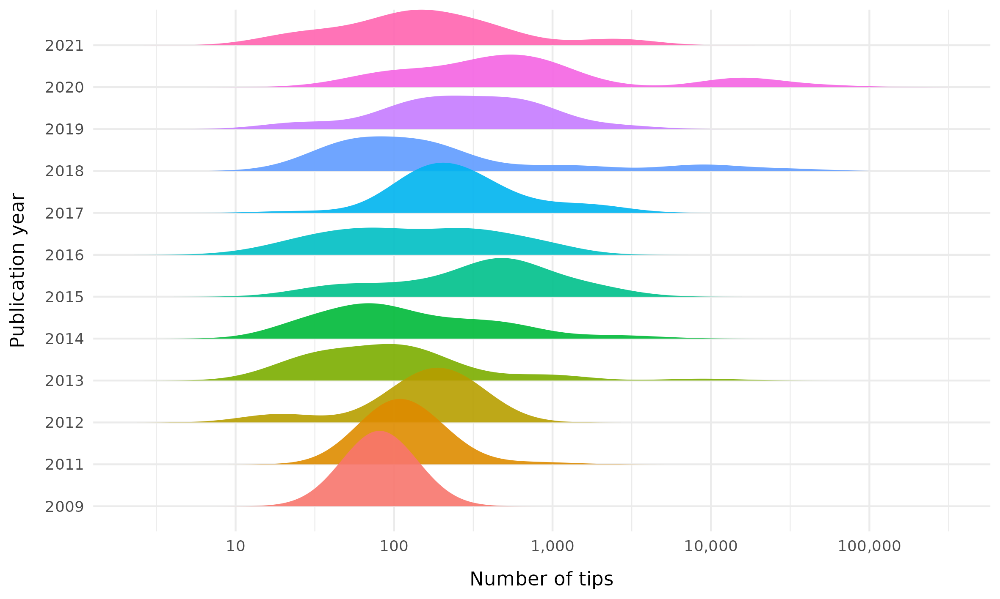

<!-- README.md is generated from README.Rmd. Please edit that file -->


```{r, include = FALSE}
knitr::opts_chunk$set(
  collapse  = TRUE,
  comment   = "#>",
  fig.path  = "man/figures/",
  out.width = "100%"
)
```


# sseReview


<!-- badges: start -->
[](https://github.com/ajhelmstetter/sseReview/actions/workflows/R-CMD-check.yaml)
[](https://choosealicense.com/licenses/gpl-2.0/)
[](#)
<!-- badges: end -->


Research Compendium of the project **DiveRS -SSE review**


### How to cite

Please cite this compendium as: 

> **{{ PLEASE ADD A CITATION }}**


### Content

This repository is structured as follow:

- [`data/`](https://github.com/ajhelmstetter/sseReview/tree/master/data):
contains all raw data required to perform analyses

- [`rscripts/`](https://github.com/ajhelmstetter/sseReview/tree/master/rscripts/):
contains R scripts to run each step of the workflow

- [`outputs/`](https://github.com/ajhelmstetter/sseReview/tree/master/outputs):
contains all the results created during the workflow

- [`figures/`](https://github.com/ajhelmstetter/sseReview/tree/master/figures):
contains all the figures created during the workflow

- [`paper/`](https://github.com/ajhelmstetter/sseReview/tree/master/paper):
contains all the manuscript and related content (biblio, templates, etc.)

- [`R/`](https://github.com/ajhelmstetter/sseReview/tree/master/R):
contains R functions developed especially for this project

- [`man/`](https://github.com/ajhelmstetter/sseReview/tree/master/man):
contains help files of R functions

- [`DESCRIPTION`](https://github.com/ajhelmstetter/sseReview/tree/master/DESCRIPTION):
contains project metadata (author, date, dependencies, etc.)

- [`make.R`](https://github.com/ajhelmstetter/sseReview/tree/master/make.R):
master R script to run the entire project by calling each R script stored in the `rscripts/` folder


### Usage

Clone the repository, open the `.Rproj` file in RStudio and run:

```{r eval = FALSE}
source("make.R")
```

### Notes

- All required packages, listed in the `DESCRIPTION` file, will be installed (if necessary)
- All required packages and R functions will be loaded
- Some analyses listed in the `make.R` might take time

### Plots

 

Figure 1. Stacked barplot of -SSE model use over time in angiosperms. Bars represent total number of times different models are used. Multiple different models can be taken from a single study, but if the same model is used multiple times it is only counted once. Black line indicates the number of studies published per year.

 

Figure 2. Ridgeplot of number of tips (log) in phylogenetic trees used in -SSE model publications on angiosperm taxa. Density plots are shown for each year separately showing a gradual increase in the number of tips in the tree over time.  

 

Figure 3. Ridgeplot of number of tips (log) in publications using -SSE models in angiosperm taxa. Density plots are shown for each -SSE model type separately, showing those model types that tend to be used with higher numbers of tips.  


Figure 4. Treemap of the orders considered in angiosperm-based studies using -SSE methods.


Figure 5. Treemap of the trait types considered in angiosperm-based studies using -SSE methods.


Figure 6. Raincloud plots of distributions of the number of tips in the phylogenetic trees in studies that infer the an effect of the investigated trait (pink) or infer no effect (green). On average more tips are found in studies that find an association.

 
Figure 7. Paired density plots of distributions of various factors in studies that infer the an effect of the investigated trait (yellow) or infer no effect (grey). Older trees and those with lower sampling fraction more often yield significant associations.


Figure 8. Scatterplot of sampling fraction against number of tips with fitted lines. Points and lines coloured by whether there was a significant association (yellow) or not (grey) between the traits and diversification rates. An almost flat relationship observed between sampling fraction and number of tips, and no effect between trait significance.


Figure 9. Barplot showing how often particular trait types are associated with changes in diversification rate. Bars are grouped by trait type and depicting number of models across the entire angiosperm -SSE dataset where a trait effect was (yellow) or was not (grey) found.


Figure 10. Horizontal barplot showing the feature importance of an [xgboost](https://xgboost.readthedocs.io/en/latest/) model used to predict whether or not a study will produce a significant association between a trait and diversification rate. Colours represent clusters of variables of similar importance.